<!-- updated -->

 
 

<table>
<tr>
<td valign="top"></td>
<td valign="top"></td>
</tr>
</table>

## Vineeth

**A passionate developer from India**

## Featured Work

**Banking Data Analysis**
Power BI, Excel — Interactive dashboard analyzing customer transactions, fee structures, and engagement patterns to identify key financial insights.

**Weather Prediction Analysis**
Python, Pandas, Scikit-learn — Linear regression and classification models on real-time weather datasets with feature engineering and prediction visualizations.

**Weather Forecast Web App**
HTML, CSS, JavaScript, OpenWeatherMap API — Responsive web app displaying real-time weather data with optimized API calls and dynamic UI updates.

**3D Aircraft Orientation Visualization**
Arduino, MPU6050, Processing IDE — Real-time aircraft simulation using gyroscope and accelerometer data to render accurate 3D orientation (pitch, roll, yaw).

**Smart Result Management System**
Python, Tkinter, SQLite — Desktop app with role-based access, secure bcrypt authentication, CRUD operations, and automated GPA/report generation.
